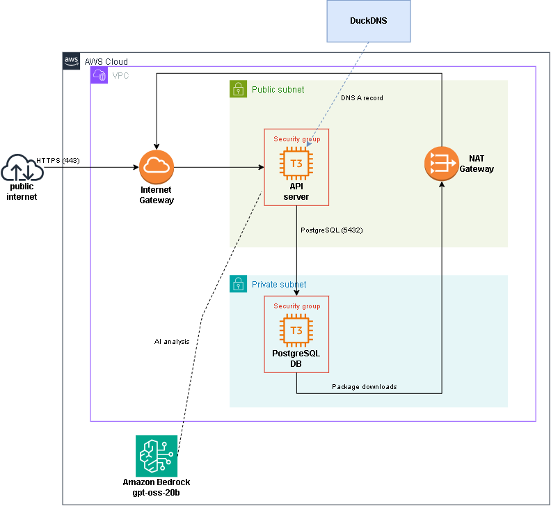

# Journal API AWS Deployment with AWS CLI

This project provisions a two-tier AWS environment for an existing Journal API.
It deploys the API and PostgreSQL database on separate EC2 instances, keeps the
database in a private subnet, exposes the API over HTTPS, and connects the
application to Amazon Bedrock.

> [!IMPORTANT]
> This repository is a fork of
> [learntocloud/journal-starter](https://github.com/learntocloud/journal-starter).
> The Journal API comes from the original project. My deployment-related changes
> are contained in the following files:
>
> ```text
> .
> ├── deploy.sh                         # AWS provisioning
> ├── scripts/
> │   ├── api_user_data.sh              # API VM setup
> │   └── database_user_data.sh         # database VM setup
> ├── api/services/llm_service.py       # Bedrock response compatibility
> ├── architecture.png                  # architecture diagram
> └── README.md                         # deployment documentation
> ```
>
> See the [original project README](README.original.md).

> [!NOTE]
> This Phase 1 deployment **intentionally uses AWS CLI for hands-on practice**. It is intended for learning and demonstration purposes only and **should not be considered production-ready**.



## Architecture

The deployment creates:

- One VPC using the `10.0.0.0/16` CIDR block
- One public subnet using `10.0.1.0/24`
- One private subnet using `10.0.2.0/24`
- An Internet Gateway and public route table
- A NAT Gateway with an Elastic IP and private route table
- One Ubuntu 24.04 `t3.small` EC2 instance for the Journal API
- One Amazon Linux 2023 `t3.small` EC2 instance for PostgreSQL
- Separate security groups for the API and database
- PostgreSQL 15 with the `career_journal` database
- Caddy as an HTTPS reverse proxy
- DuckDNS for the public API domain
- Amazon Bedrock using its OpenAI-compatible endpoint

The API instance is placed in the public subnet and receives a public IPv4
address. The database instance is placed in the private subnet and does not
receive a public IP address.

All created AWS resources are tagged with:

```text
Project=aws-cli-practice
```

### HTTPS with Caddy

The project uses Caddy as the HTTPS reverse proxy for the public API.

1. DuckDNS points the API domain to the public IP of the API VM.
2. Caddy listens on ports 80 and 443 and redirects HTTP requests to HTTPS.
3. Caddy obtains a trusted TLS certificate and renews it before it expires.
4. Caddy handles the TLS handshake, terminates HTTPS, and forwards the decrypted
   request to Uvicorn at `127.0.0.1:8000`. Port `8000` is not exposed by the
   security group.

### Routing

| Route table | Associated subnet | Destination | Target |
|---|---|---|---|
| Public | `10.0.1.0/24` | `10.0.0.0/16` | Local VPC route |
| Public | `10.0.1.0/24` | `0.0.0.0/0` | Internet Gateway |
| Private | `10.0.2.0/24` | `10.0.0.0/16` | Local VPC route |
| Private | `10.0.2.0/24` | `0.0.0.0/0` | NAT Gateway |

The public route provides internet connectivity for the API VM, while the
private route allows the database VM to download packages without exposing it
directly to the internet.

## Traffic flow

DNS resolution follows this path:

```text
Internet client
    |
    | Resolve API domain
    v
DuckDNS
    |
    | Returns API public IP
    v
Internet client
```

API traffic follows this path:

```text
Internet client
    |
    | HTTPS/443
    v
Internet Gateway
    |
    v
Caddy on the public API VM
    |
    | HTTP to 127.0.0.1:8000
    v
Journal API running with Uvicorn
    |
    | PostgreSQL/5432 using the DB private IP
    v
PostgreSQL VM in the private subnet
```

AI analysis requests follow this path:

```text
Journal API
    |
    | HTTPS/443
    v
Amazon Bedrock OpenAI-compatible endpoint
```

The database VM uses the NAT Gateway for outbound internet access required
during package installation:

```text
Private database VM
    |
    v
Private route table
    |
    v
NAT Gateway
    |
    v
Internet Gateway
    |
    v
Internet
```

## Security model

### API instance

The API EC2 instance is placed in the public subnet and has a public IPv4
address.

Inbound rules:

- TCP/80 from `0.0.0.0/0`
- TCP/443 from `0.0.0.0/0`

Outbound rules:

- All IPv4 traffic to `0.0.0.0/0` through the Internet Gateway

### Database instance

The PostgreSQL EC2 instance is placed in the private subnet, has no public IPv4
address, and is not directly reachable from the internet.

Inbound rules:

- TCP/5432 from `10.0.1.0/24`

Outbound rules:

- All IPv4 traffic to `0.0.0.0/0` through the NAT Gateway

## Idempotency

The `deploy.sh` script checks whether the required AWS resources already exist
before creating them.

Running the script again reuses matching resources such as:

- VPC and subnets
- Internet Gateway
- NAT Gateway and Elastic IP
- Route tables
- Security groups
- API and database EC2 instances

This prevents the deployment from creating duplicate infrastructure during
normal repeated execution.

> [!WARNING]
> Changing a user-data script and re-running `deploy.sh` does not apply the
> changes to an existing EC2 instance. User data runs only when the instance is
> created, so the affected instance must be recreated to use the updated script.

# How to use (Linux)

## Prerequisites

- Bash
- AWS CLI v2
- An authenticated AWS CLI session
- An AWS identity with permissions to create the required resources
- A DuckDNS account and API token
- A DuckDNS subdomain
- An Amazon Bedrock API key
- Access to the configured Amazon Bedrock model

Do not use the AWS account root user.

Verify the AWS CLI and current identity:

```bash
aws --version
aws sts get-caller-identity
```

## Deployment

Make the deployment script executable:

```bash
chmod +x deploy.sh
```

Run it from the repository root and provide the required input values. Set
`DUCKDNS_SUBDOMAIN` to the name only, without `.duckdns.org`:

```bash
export DB_PASSWORD='<database-password>'
export DUCKDNS_SUBDOMAIN='<duckdns-subdomain>'
export DUCKDNS_TOKEN='<duckdns-token>'
export OPENAI_API_KEY='<bedrock-api-key>'

./deploy.sh
```

The script will:

1. Create or reuse the network resources.
2. Create the security groups and routing rules.
3. Provision the private PostgreSQL VM.
4. Install PostgreSQL and apply `database_setup.sql`.
5. Provision the public API VM.
6. Clone the Journal API repository.
7. Install the application dependencies.
8. Configure the database and Bedrock connection.
9. Start the API as a systemd service.
10. Configure Caddy and obtain a TLS certificate.
11. Point the DuckDNS domain to the API public IP.
12. Print the created resource identifiers and verification information.

## Verification

Verify DNS resolution:

```bash
API_DOMAIN="${DUCKDNS_SUBDOMAIN}.duckdns.org"
nslookup "$API_DOMAIN"
```

Verify HTTPS and the API response:

```bash
curl -v "https://${API_DOMAIN}/entries"
```

The request should return:

- A trusted TLS certificate
- HTTP status `200`
- No redirect
- A valid JSON response

Example:

```json
{
  "entries": [],
  "count": 0
}
```

Create a journal entry:

```bash
curl --fail --silent --show-error \
  -X POST \
  "https://${API_DOMAIN}/entries" \
  -H "Content-Type: application/json" \
  --data '{
    "work": "Deployed the Journal API to AWS",
    "struggle": "Troubleshooting connectivity between the API and database",
    "intention": "Add monitoring and improve the deployment checks"
  }'
```

The response should have HTTP status `201` and contain the new entry under the
`entry` key. Copy its `id`, then set it as an environment variable:

```bash
ENTRY_ID='<entry-id-from-the-create-response>'
```

Verify that the entry can be retrieved:

```bash
curl --fail --silent --show-error \
  "https://${API_DOMAIN}/entries/${ENTRY_ID}"
```

Finally, verify Amazon Bedrock analysis for the entry:

```bash
curl --fail --silent --show-error \
  -X POST \
  "https://${API_DOMAIN}/entries/${ENTRY_ID}/analyze"
```

The response should contain:

- `sentiment`
- `summary`
- `topics`

## Cleanup

The project does not currently include an automated cleanup script.

All resources can be located using the following tag:

```text
Project=aws-cli-practice
```

Resources should be removed in dependency order, starting with the EC2
instances and NAT Gateway before deleting networking resources.

# Potential improvements

- Replace the AWS CLI Bash script with Terraform
- Add an automated cleanup script
- Store secrets in AWS Secrets Manager or Systems Manager Parameter Store
- Allow PostgreSQL access from the API security group instead of the entire
  public subnet CIDR
- Replace the PostgreSQL EC2 instance with Amazon RDS
- Deploy the API across multiple Availability Zones
- Place an Application Load Balancer in front of the API instances
- Add monitoring and alerts using Amazon CloudWatch
